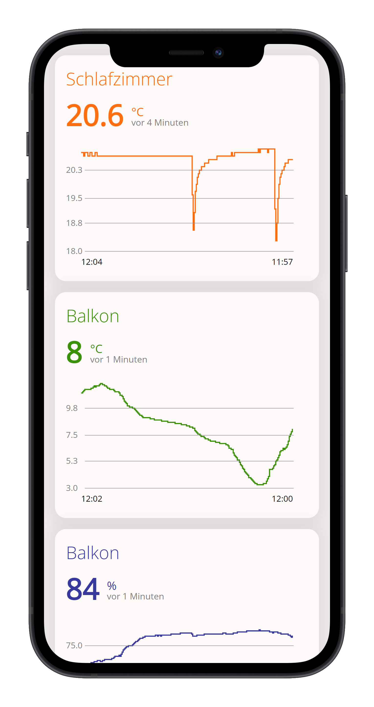

# Mobile Alerts - meine Sensoren
Dies ist ein einfaches Dashboard für Deine Mobile Alerts-Sensoren (verkauft unter den Marken Technoline, TFA, ELV oder Thermo Connect). Das Dashboard ersetzt nicht die App des Herstellers (und wird es auch in Zukunft nicht), sondern ergänzt die (lieblos gestaltete) App. Dieses Dashboard soll Dir eine schnelle Übersicht über Deine Sensoren bieten, optimiert für Smartphones. Du kannst es kostenlos nutzen oder einen eigenen Server betreiben.

[» Zum Dashboard](https://mobilealerts.vercel.app/)
<p align="center">
  
</p>

Aktuell werden nur Temperatur- und Feuchtigkeitssensoren unterstützt. Deine Daten werden nicht gespeichert, alle Messwerte werden direkt vom Mobile Alerts-Server geholt. Die Seite speichert jedoch Deine Sensoren in Deinen Cookies, damit Du sie beim nächsten Aufruf nicht erneut eingeben musst.

Suchst Du einen automatisierten Datenexport? Dann schaue Dir [dieses Projekt](https://github.com/simonhuwiler/mobile-alerts-datastore) an.

## Selber hosten
Du kannst das Dashboard mit wenig Aufwand selbst hosten. Die Website braucht einen Api-Proxy, um die Anfragen weiterzuleiten. Wir nutzen Node. Mit folgender Anleitung kannst Du einfach und kostenlos Deinen eigenen Server starten. Möchtest Du es auf einem bestehenden Server ohne Node laufen lassen, dann schau Dir die Anleitung weiter unten (`Für Entwickler`) an.

### 1. Accounts erstellen
Du brauchst Accounts bei zwei Diensten, beide sind kostenlos:
* [GitHub](https://www.github.com)
* [Vercel](https://vercel.com/) (Du kannst Deinen GitHub-Account nutzen)

### 2. Project Forken
Du musst eine Kopie des Source-Codes in Deinem Account erstellen. Klicke hier, wo Du gerade bist, oben rechts auf `Fork`. Klicke auf `Create fork`. Nun hast Du eine Kopie angelegt.

### 3. Deployen/Veröffentlichen
* Erstelle auf Vercel ein neues Projekt (`Add New...` / `Project`).
* Wähle oder suche das geforkte Repository. Siehst Du es nicht, klicke auf `Adjust GitHub App Permissions` und erteile Vercel die nötigen Berechtigungen.
* Klicke auf Deploy

Nach ein paar Sekunden ist Deine Seite online.

## Für Entwickler
### Installation
```
npm install
npm run dev
```

### Ohne Node-Server deployen
Das Dashboard braucht einen Apiproxy, der die Anfrage an den Server von Mobile Alerts weiterleitet und dabei wenige Header-Informationen anpasst. Willst Du die Seite ohne Node-Server hosten, musst Du folgende Anpassungen vornehmen:

**1. Svelte-Adapter ändern**  
Installiere den static-adapter:
```
npm install @sveltejs/adapter-static
```
Ersetze nun in `svelte.config.js` folgende Zeile...
```js
import adapter from '@sveltejs/adapter-auto';
```
... mit...
```js
import adapter from '@sveltejs/adapter-static';
```

Den Adapter musst du auf `strict=false` setzen. Ersetze...
```js
adapter: adapter()
```
... mit...
```js
adapter: adapter({
	strict: false
})
```
Alternativ kannst Du `svelte.staticsite.config.js` unbenennen in `svelte.config.js`.

**2. Api-Adresse anpassen**  
Öffne `src/routes/config.ts` und ersetze `export const apiUrl:string = '/api'` mit der URL zu Deiner API. Zum Beispiel:
```js
export const apiUrl:string = 'https://www.meinserver.com/api.php'
```

**3. Erstelle die Api**  
Du musst nun eine eigene Api veröffentlichen. Wir haben einige in verschiedenen Sprachen (PHP, Python) erstellt. Falls Du eine andere Sprache nutzen möchtest, kannst Du einen eigenen Proxy schreiben. Du findest alles dazu [in diesem Repository](https://github.com/simonhuwiler/mobilealerts-api).

**4. Build erstellen**  
Nun kannst Du einen Build erstellen, den Du auf Deinen Server hochladen kannst. Der Build wird im Ordner `/build` erstellt.
```bash
npm run build
```
